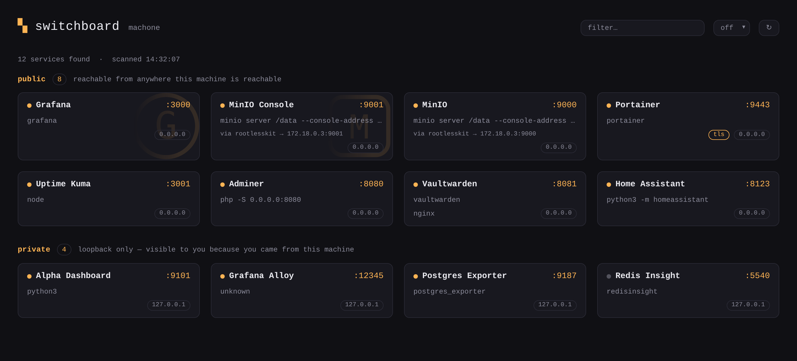
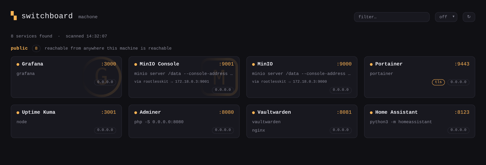

# Switchboard

A single page that links to every HTTP service running on this Linux box.

Switchboard reads `/proc` to find every socket in `LISTEN`, works out which
process owns each one, probes each at the address it bound to to see which
actually speak HTTP, and renders the survivors as a grid of cards. It shows more to you than it
shows to the rest of your network.

One static Go binary. No database, no config file, no runtime dependencies.

Same box, two views — the private tier only ever reaches a caller on loopback,
so a LAN visitor's response is missing those cards, not merely hiding them:





(Service names and processes above are illustrative, not a live box.)

## Running it

```sh
make build           # -> bin/switchboard
./bin/switchboard    # http://localhost:8090
```

`make build` regenerates the Tailwind CSS and the templ Go files first. Both
outputs are checked in, so a plain `go build ./cmd/switchboard` works on a
machine with neither tool installed.

| Flag | Default | Meaning |
|---|---|---|
| `--port` | `8090` | Port to listen on. |
| `--trust-forwarded` | `false` | Classify origin from `X-Forwarded-For` instead of the peer address. Off by default for good reason — see [docs/security.md](docs/security.md). |

To run it as a service:

```sh
make install         # binary to /usr/local/bin, unit to /etc/systemd/system
sudo systemctl enable --now switchboard
```

The unit runs as a dynamically allocated unprivileged user and grants two
capabilities, purely so sockets owned by other users can be named. Removing them
is a reasonable choice; [docs/security.md](docs/security.md) explains the
tradeoff.

## The tier split is presentation, not access control

Switchboard sorts services into `public` and `private` by the address each one
bound to, and `private` entries never leave the machine — they are absent from
the HTML, not hidden with CSS. But Switchboard is an index, not a gate: it does
not proxy anything, it has no authentication, and a port that isn't on the page
is still just as reachable as before.

**If something must be private, bind it to loopback.** Read
[docs/security.md](docs/security.md) before relying on the tier split.

## How it works

There is no background scanner and no scan interval — everything happens on
demand, when a request arrives, so an idle Switchboard burns zero CPU. Results
are cached in layers (inode→PID attribution for 30s, successful HTTP probes for
the life of the process, liveness never), and container port-forwards are chased
through `/proc` to the real process behind them.

[docs/discovery.md](docs/discovery.md) covers all of it: the refresh model,
the cache keys, how services get their names and icons, HTTPS detection, and the
namespace walk that turns `rootlesskit` into `minio server /data`.

## Design

The palette, font stack, card geometry and dark/light mechanism are lifted
verbatim from [Scratchpad](../scratchpad): the same seven CSS custom properties
with the same values, the same `prefers-color-scheme` override, the same
monospace system stack, the same 10px cards on a `minmax(320px, 1fr)` grid, and
the same `▚` mark. Tailwind's colour utilities are mapped onto those variables
rather than replacing them, so `bg-surface` and `text-accent` resolve through
Scratchpad's own tokens. `htmx.min.js` is a byte-for-byte copy of Scratchpad's.

## Non-goals

No auth, no reverse proxying, no uptime history, no metrics, no config file, no
non-Linux support. Switchboard reads `/proc` and renders a page.

## Layout

```
cmd/switchboard/main.go     flags and wiring
internal/discover/
  proc.go                   /proc/net/tcp{,6} parsing (hex, little-endian, v4+v6)
  process.go                inode -> PID attribution, cached 30s
  probe.go                  HTTP identity probe (cached) and TCP liveness (not)
  forward.go                follows container port-forwards to the real process
  icon.go                   favicon discovery, fetching and validation
  registry.go               tiering, self-exclusion, stale-while-in-flight
internal/web/
  server.go                 two routes: the page and the fragment
  origin.go                 loopback-vs-remote classification
  templates/*.templ         layout and cards
  assets/                   input.css (Tailwind source) -> style.css, htmx,
                            search.js (filter), refresh.js (auto-refresh)
systemd/switchboard.service
```

## Tests

```sh
make test
```

The tests cover the parts that are easy to get quietly wrong: the little-endian
hex address encoding for both address families (including v4-mapped sockets in
`tcp6`), `LISTEN`-state filtering, `/proc/<pid>/stat` field extraction when the
command name itself contains spaces and parentheses, `<title>` parsing, and the
origin gate — in particular that a spoofed `X-Forwarded-For` cannot reach the
private tier while `--trust-forwarded` is off.
